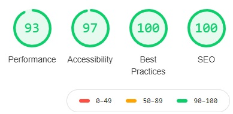

# Milestone Project Two

## JavaScript Game

Welcome to my second milestone project! As I feel very confident with business style web design, I wanted to undertake a project 
that is very different from anything I have coded before and would test my JavaScript skills, this is why I chose to create a game 
for this project. 

Based on the style of the gaming classic Tetris, Blocks Away is a browser based JavaScript game packed with interactive features. 

For this project, I wanted to try and recreate the 8-bit era, which you will notice in both the audio and styling of the page. 

Further specific information on this project can be found below:

### Table of contents:
1. [Description](#Description),
2. [UX](#UX)
    1. [Logo](#Logo)
    2. [Wireframes](#Wireframes)
    3. [User Stories](#User-Stories) 
    4. [Information Architectures](#Information-Architectures)
    5. [Responsive Design](#Responsive-Design)
    6. [Frameworks](#Frameworks)
    7. [Typography](#Typography)
    8. [Colors](#Colors)
    9. [Icons](#Icons)
3. [Features](#Features)
    1. [Existing Features](#Existing-Features)
    2. [Future Features](#Future-Features)
4. [Technologies Used](#Technologies-Used)
5. [Testing](#Testing)
6. [Deployment](#Deployment)
    1. [Local Deployment](#Local-Deployment)
    2. [Remote Deployment](#Remote-Deployment)
7. [Credits](#Credits)
    1. [Media](#Media)
    2. [Content](#Content)
    3. [Acknowledgments](#Acknowledgments)

## **Description**
This JavaScript game is based on the retro classic Tetris. A players objective is to fill rows with blocks. Each complete row will clear that line, and add points
to the scoreboard.

For each line that is cleared, a player will earn 10 points. A simple local storage addition means that players will have their top score saved 
for any future games (*unless they delete their cookies).

### **Game Concept**
The original concept for this game only contained ones and zeros. I would implement a table, which would be full of 0's, then I could add 1's in certain cells to 
make it look like "blocks". If the top row had a 1 in the row then it would be game over, if any row below row 0 was full of 1's this row could be replaced with 
0's (clearing the line). 

If a string reached the last row, it would merge into the board string and we would now add a new string at the top of the table. The same would take place when 
a string landed on another string.

Only later I thought that instead of looking for specific 1's or 0's, I could condense this into looking for "!0", this allows me to use different numbers in the strings 
which can be assigned different colors for styling. Essentially if "(x == 0).... else if (x == 1)" became "if (x != 0)". 

By defining preset strings which look like shapes, I could use math random to call these known strings when needed.

The only section I was initially unsure how to implement was the rotation of blocks. The original plan for this was to have an IF statement, so if a player pressed 
a button, I would actually replace the string. This would have meant creating strings for each possible 'state' of the blocks. Luckily I found the idea of transposing 
an array and this process can be done for me by the computer.

---------------
## **UX**

As with all projects, creating a great UX design was the cornerstone for this projects design. The design used, means that anyone who has a history of playing 
video games will immediately be familiar with the layout, as well as being easy enough that those who are not familiar with video game menu's will be capable of 
navigating easily between all the individual sections.

### 5 Planes of UX:
#### 1. Strategy:
> The strategy for this project is to produce a game where users can have fun playing. 
> As this project will probably be contained on my Portfolio in the future, a contact form, and links to my social media will be placed in sub menu areas.

To expand further on strategy, I have included some user stories. They can be found in the [user stories](#User-Stories) section.

#### 2. Scope:

*Functional Requirements:*
> 1. A player must be able to fully control the blocks within the game.
> 2. Game logic must limit the movement of blocks to the area within the game 'board'.
> 3. Game logic must recognize when a row is complete, then delete this row.
> 4. Game logic must recognize when a block lands on the bottom of the board, or another block, when this happens we must merge these objects.
> 5. A player must be able to start or stop audio.
> 6. Finally the game must offer different difficulties to make the game fun for players of all abilities.

*Content Requirements:*
> 1. Details of how to play the game, such as controls (to include the difference for desktop and mobile).
> 2. Information on the optimal devices to play the game.
> 3. Attribution for media and sounds as per their usage agreements.
> 4. Feedback areas to notify users and give feedback, such as clicking the sound button should then have text "sound selected off".

#### 3. Structure:
> * A user interface that functions like a game menu.
>
> * Each screen should provide a limited amount, but quality information to a user.
>
> * A game screen should be sized to allow mobile users see the entire board and controls on one screen, the most restrictive I have come across are the older 
model iPhones, on these devices a user will see the game screen and controls, but would have to scroll to see the scoreboard. On newer devices such as the iPhone X 
a user will be capable of seeing the scoreboard, board, and controls all in one display.

#### 4. Skeleton:
> As I wanted to develop a website around the game, rather than design a game around a website I created wireframes that were quite basic.
> As I wanted to emulate games from 1990's era, I created wireframes after looking at pictures of retro SNES, and GameBoy menu screens. 
> 
> As this project will appear the same across all devices, one set of wireframes was used to implement this project.
>
> You can view the wireframes for this project [here](#Wireframes)

#### 5. Surface:
>  In an attempt to recreate an 8-bit era, use a font that looks like an 8-bit font.
>
>  Build a main screen whereby a user can simply access a sub section, before returning to the main screen.
>
>  Allow user inputs to change the state of the code, for example turning audio on or off, selecting difficulty etc.

### <ins>**_Logo_**</ins>
Although there is no logo for this game, the welcome video starts off using the logo of John O'Brien (me).

### <ins>**_Wireframes_**</ins>
You can view the wireframe designs [here](assets/readme/wireframes.pdf)

This project will maintain the same style regardless of viewing device

### <ins>**_User Stories_**</ins>

Being a web game the following user stories specific to this project are: 

| **As the creator I want to:** |
| ------------------------------------------------------- |
|1. *Have fun playing the game.* |
|2. *Create a program I have never created before.* |
|3. *Expand my JavaScript and jQuery skills.* |
|4. *Allow players to contact me with feedback* |

| **As a user I want to:** |
| ------------------------------------------------------- |
|1. *Play a fun game.* |
|2. *See instructions on how to play the game.* |
|3. *Be capable of changing settings to my liking.* |
|4. *See who created the game.* |
|5. *Contact the creator.* |

### <ins>**_Information Architectures_**</ins>
For this project I wanted to use a design that meets UX design goals as well as functioning in a similar way to what 
users would expect. 
A lot of users have probably played a video game with a basic navigation menu, so I chose to follow a similar structure to allow users 
see this menu as something that is easy for them to navigate through and eaily access the information they choose (click) to see.

The main menu buttons follow a hierarchical structure, with PLAY being the highest authority button, followed by INSTRUCTIONS etc.

The page with the most content is the instructions page, in order not to overwhelm the user I have split this page into sections. 
By doing this a user can view the individual section of information or read through as much information as they wish before navigating 
back to the main menu.

All but one links on this project will only navigate from the main menu into a section, or back to the main menu. The only exception to 
this rule is the "email" button on the social page, which will navigate to the "contact form". 

### <ins>**_Responsive Design:_**</ins>
This project is fully responsive and has been tested on screen widths between 375px up to 3800px.

### <ins>**_Typography_**</ins>
This project uses "Press Start 2P" (Google Fonts), this font is an 8-bit style font to help the design of the project.

### <ins>**_Colors_**</ins>
The main color used in this project is rgb(0, 201, 10) which is the green color seen throughout this project.

The other color of note is the background color of the canvas. This is a greenish-brown color, which is the same color of the old GameBoy screens.

The colors for the 8 different blocks were chosen somewhat at random, which span the spectrum of colors to allow users easily differentiate between different blocks.

### <ins>**_Icons:_**</ins>
Although this project does not use too many icons, they do play a very important role for the game. The button controls which allow 
tablet and mobile users control the blocks in this game use easy to understand icons instead of text. 

--------------------
## **Features**

### <ins>**_Existing Features:_**</ins>

Currently, this project has several features which include:

Sound Effects:

* Sound effect features are scattered around this project and contained within the game itself. If the sound is selected on, menu selections to enter a section will 
play a specific noise, once in an area, if a user selects to return to the main menu a different noise is played.

* Within the game, if the sound is selected ON, the main menu audio will change to the game song, a 'thud' noise is played each time a block lands, and a zap noise 
is played when a line break is detected. When a user has lost the game, the game song will pause, and game over music will play. On returning to a new game the game song 
will play again. 

Popup Intro:

* A popup window which holds an into video, as well as a description of the game means a user can tell what this page is before even moving past this screen.

Main Menu:

* The main menu of this project is interactive, with hover events and event listeners for mouse or touchscreen inputs.

Settings Screen:

* The settings screen is interactive, and supplies feedback to a user. For example on clicking the "Sound: ON" a user will see the change of text, they will also see the global 
sound button (top right) change to the selected setting, and will hear music starting. 

High Score:

* On starting this game, the game will check for a stored high score. If a high score exists in a users browser, then that score will be displayed. If no high score is 
found, then a 0 is placed here. When a user loses a game, the current score will be compared to see if a new high score has been achieved, if the score is higher than the 
saved high score, then the game will automatically replace the old high score with the new high score.

Background Animation:

* In the background (behind the card, and ontop of the background image) there are animated shapes flying.

Social Card:

* A 3D social card is contained in the SOCIAL page. This card reacts to a users mouse position and reacts according to the X & Y values of the mouse position. Due to 
styling, this animation is only available on screens larger than 769px (anything larger than an iPad).

Difficulty:

* A player/user can select from 3 game starting difficulties. This allows players of different skill levels enjoy the game.
* A progressive function within the game code, means that the game will accelerate as a user is playing, this is done by a function called "progression()" which is called 
every time a block lands. This mode was added after I first played the game and there was no real ending unless I chose to lose. By adding this function, the game will eventually 
overpower even the best players, which adds an element of 'competition' to the game.

#### *Implemented but removed:*

Speech Recognition:

* This project originally contained speech recognition which allowed a user to navigate, press buttons, fill out the contact form, and play (i.e move a block left by saying "left") 
using their voice. This feature however only worked on Chrome, and was causing bugs when viewed on differnt browsers, so the decision was made to remove this feature.
I now have a thorough understanding of this so I plan on implementing this as soon as it is more readily available on other browsers.

### <ins>**_Future Features:_**</ins>

One feature I did really want with this project was a global high score sheet, where users (if good enough) would have their score and a username pinned to a 'global' 
scoreboard. Unfortunately at this time I do not have the knowledge to implement this, so I chose to wait until I fully understand this process before implementing it 
in this game.
    
------------------
## **Technologies Used**

Blocks Away uses HTML, CSS and JavaScript with the addition of Bootstrap and jQuery. To allow for functionality of the contact form, an email API from EmailJS has been 
used.

---------------------
## **Testing**

This project has passed through several phases of testing, these phases include:

1. [W3 Validator](https://validator.w3.org/) to check all HTML. 

2. [W3 'Jigsaw' Validator](https://jigsaw.w3.org/css-validator/) to check all CSS.

3. [JS Hint](https://jshint.com/) to check all JavaScript. 

> I originally planned to use Jasmine testing for this project, however, there seems to be issues around Jasmine testing and Canvas which was proving to be limiting 
the progress on this project. As a result, I changed strategy to a more real time testing program, this included testing the results of of single and multiple functions 
through dev tools and console.log. Details of these methods are below:

**Console.Log:** During the creation of this code, logging the results of each function was key. As this project relies on ALL functions to operate correctly, without fail 
it was imperative that all functions supply a correct answer or value in a timely manner.

**Dev Tools:** While creating this game, I took note of all function names, variables and objects. With this sheet, I was able to open a game and check different parameters 
at different times of a game. This also allowed me to force in parameters to check certain results. For example halfway through a game when a user would normally be "alive" 
I would give "alive" a value of "false", with this variable set, I know the outcome should be that the game essentially "pauses". 

Testing through playing: Knowing the outcome I wanted, I tested certain scenarios whilst "playing" the game. This included aspects such as trying to position a block off the 
board. 

Finally I wanted to make this project as fast and accessable as possible, for this I used Dev tools again.

### **Bugs**:

Multiple bugs were found in the creation of this project.

IOS Bug: (Older versions of IOS)

> The JavaScript in this project does not run on older IOS devices, but has been tested on IOS 14.2 with no faults. The problem seems to be with ".click" and ".on("click,...)".
> After checking for a fix online, it seems as though this is a widespread bug which has been solved on all newer IOS devices. 
>
> To try and fix this issue, I have followed guidelines online including setting the cursor to pointer and using touchstart, however, this is still a problem on older IOS 
versions.

Internet Explorer: (Old Browser)

> There is a similar bug with the old Microsoft Internet Explorer as seen in the older versions of IOS and Safari. This problem seems to be with the same jQuery and 
> certain JavaScript elements, such as "getElementByClassName". As this browser is now outdated, and this project running smoothly on the newer Microsoft Edge I 
> decided, given this browser is now outdated and obsolete that I would not correct my code to cater for an obsolete service.

Unwanted Navigation:

> Probably one of the most strange problems I have come across was this bug. In the Social page, there is a button at the bottom of the card labelled Email. Connected to this 
> is an event which will bring the user to the contact form if clicked. On testing, this button was displaying the "Settings" page when clicked, I was unable to find any reference
> why this was happening which is why in the general.js file, I have specifically added "$(".settings").hide();" to stop this from happening. 

Rotation Of Blocks:

> This one is still a handful to understand completely, originally I got stuck on this feature so tried multiple possible solutions found on W3 schools, and StackOverflow.
> Luckily this problem can be solved quite easily by transposing a 2D array and JavaScript will do the hard work!

--------------------
## **Deployment**

### <ins>**_Remote Deployment:_**</ins>
To deploy this project remotely, you can follow these steps:
>1. Log Into GitHub.
>2. Navigate to my GitHub repository for this project which can be found [here](https://github.com/J-O-B/game-project).
>    
>   (Close to the top of the page, there is a navigation bar, the first item here is "<>Code", the last item is "Settings".)
>
>3. Click on settings
>4. Scroll down the page until you find the section labeled "GitHub Pages"
>5. The first item in GitHub Pages is "Source", click the associated dropdown button labeled "None". 
>6. You will now have to select "master branch" as the source.
>7. Once you have selected "master" click the "Save" button. 
>8. The page should now refresh so you may have to scroll back down to "GitHub Pages".
>9. Now you will see a link presented which should look like this https://j-o-b.github.io/game-project/.

### <ins>**_Cloning This Project:_**</ins>
>1. On GitHub, navigate to the main page of the repository.
>2. Above the list of files, click download Code icon. (a down arrow with a line under it)
>3. To clone the repository using HTTPS, under "Clone with HTTPS", click the clipboard icon. To clone the repository using an SSH key, 
> including a certificate issued by your organization's SSH certificate authority, click Use SSH, then click the clipboard icon. 
> To clone a repository using GitHub CLI, click Use GitHub CLI, then click the clipboard icon.
>4. Open Git Bash.
>5. Change the current working directory to the location where you want the cloned directory.
>6. Type git clone, and then paste the URL you copied earlier.
>7. Press Enter to create your local clone.

(Further information on cloning can be found at [GitHub Docs](https://docs.github.com/en/free-pro-team@latest/github/creating-cloning-and-archiving-repositories/cloning-a-repository)

----------------------
## **Credits**
This project, although peiced together by myself, incorporates images, video, sound and code from multiple sources. These include:
    

### <ins>**_Media:_**</ins>
**Background Image** - [Pixabay Stock & Royalty Free Image](https://pixabay.com/)

**Intro Video** - [Video Snippets From Pixabay](https://pixabay.com/)

**Sound Effects** - [ZapSplat.com](https://ZapSplat.com)

* Background Music : "New Hope",

* Game Music : "SawSquareNoise",

* Game Over Sound: General game sounds,

* Back Sound: General game sounds.

### <ins>**_Content:_**</ins>
All text content is my own.

### <ins>**Code:**</ins>
>**Social Card** - ["Dev Ed" YouTube](https://www.youtube.com/watch?v=XK7T3mY1V-w&t=1855s)
>
>**Animated Background** - [Free Frontend](https://freefrontend.com/css-animated-backgrounds)

*I have used W3 Schools and StackOverflow when I did not achieve a result, references to some of these codes are also contained in notes in my scripts.*

### <ins>**_Acknowledgments:_**</ins>
I would like to acknowledge my mentor <ins>Caleb Mbakwe</ins> for his tips during this project.

## *Previews*:
### Main Menu:

### Settings Screen:

### Social Screen:

### Game Screen:

